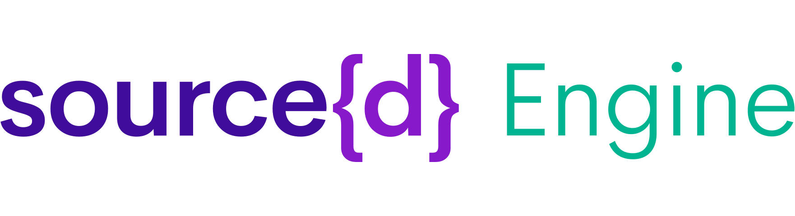

**Powerful language-agnostic analysis of your source code and git history.**

[Website](https://www.sourced.tech/engine) •
[Documentation](https://docs.sourced.tech/engine) •
[Blog](https://blog.sourced.tech) •
[Slack](http://bit.ly/src-d-community) •
[Twitter](https://twitter.com/sourcedtech)

## Introduction

source{d} Engine exposes powerful [Universal ASTs](#babelfish-uast) to analyze your code and a SQL engine to analyze your git history:

- **Code Processing**: use git repositories as a dataset.
- **Language-Agnostic Code Analysis**: automatically identify languages, parse source code, and extract the pieces that matter with language-independent queries.
- **Git Analysis**: powerful SQL based analysis on top of your git repositories.
- **Querying With Familiar APIs**: analyze your code through powerful friendly APIs, such as SQL, gRPC, and various client libraries.

This repository contains the code of **source{d} Engine** and the project documentation, which you can also see properly rendered at [docs.sourced.tech/engine](https://docs.sourced.tech/engine).

Currently, **source{d} Lookout** is in development process.

### Contents

- [Quick Start](#quick-start)
- [Architecture](#architecture)
- [Contributing](#contributing)
- [Community](#community)
- [Credits](#credits)
- [License](#license)

## Quick Start

source{d} Engine supports Linux, macOS and Windows.

You will find in the [Quick Start Guide](docs/quickstart.md) all the steps to get started with source{d} Engine, from the installation of its dependencies, to running SQL queries to inspect git repositories.

## Architecture

_For more details on the architecture of this project, read [docs/architecture.md](docs/architecture.md)._

source{d} Engine functions as a command-line interface tool that provides easy access to components of source{d} stack for Code As Data.

It consists of a daemon managing all of the services, which are packaged as Docker containers:

- [enry](https://github.com/src-d/enry): language classifier
- [babelfish](https://doc.bblf.sh): universal code parser
  - [daemon](https://github.com/bblfsh/bblfshd): Babelfish server
  - [language drivers](https://github.com/search?q=topic%3Adriver+org%3Abblfsh&type=Repositories): parsers + normalizers for programming languages
  - [babelfish-web](https://github.com/bblfsh/web): web client for Babelfish server
- [gitbase](https://github.com/src-d/gitbase): SQL database interface to Git repositories
  - [gitbase-web](https://github.com/src-d/gitbase-web): web client for gitbase

## Contributing

Contributions are **welcome and very much appreciated** 🙌
Please refer [to our Contribution Guide](CONTRIBUTING.md) for more details.

## Community

source{d} has an amazing community of developers and contributors who are interested in Code As Data and/or Machine Learning on Code. Please join us! 👋

- [Community](https://sourced.tech/community/)
- [Slack](http://bit.ly/src-d-community)
- [Twitter](https://twitter.com/sourcedtech)
- [Email](mailto:hello@sourced.tech)

## Credits

This software uses code from open source packages. We'd like to thank the contributors for all their efforts:

- [Cobra](https://github.com/spf13/cobra)

## License

Apache 2.0, see [LICENSE](NOTICE.md)
