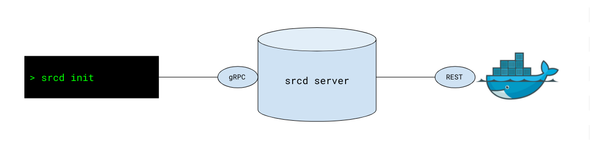

#  Engine Architecture

- [Philosophy](#philosophy)
- [Technical Architecture](#technical-architecture)
    - [the srcd binary](#the-srcd-binary)
    - [the srcd-server daemon](#the-srcd-server-daemon)

The source{d} Engine provides a frictionless experience
for the Code as Data suite of tools developed at source{d}.
In order to do this, we heavily depend on Docker, which is
the only dependency.

You can find more information on this [Design Document](https://docs.google.com/document/d/1Fw-qE8mC3lZUP5hoH1Jo5bYcGV0Z018uAq7er3oAMLw/edit?pli=1#).


## Philosophy

A note on the philosophy of the project seems adequate at
this point. The whole goal of this project is to reduce
friction for a user to embrace source{d} technologies.
Therefore we are trying to minimize the interaction needed
to accomplish most use cases.

For instance, in order to parse a Go file and obtain its
UAST the normal flow would be:

1. install bblfsh
2. install the Go driver for bblfsh
3. send a gRPC request or use the bblfsh SDK

Using source{d} Engine, it can be done running:
```shell
srcd parse uast main.go
```

For a full list of the commands supported or planned, see [commands.md](commands.md).

All of the steps described above will instead be transparently
performed by Engine.

## Technical Architecture



The whole architecture is based on a single CLI binary
written in Go named [srcd](../cmd/srcd/main.go) and an orchestrating
daemon running inside of Docker itself named
[srcd-server](../cmd/srcd-server/main.go).

### The srcd Binary

The `srcd` binary is the user's main interaction mechanism
with the source{d} Engine. It is also the only piece (other
than Docker) that the user will need to explicitly download
on their machine to get started.

The `srcd` binary is a thin client communicating with the
`srcd-server` process via gRPC. It provides a list of commands
and sub commands implemented with [cobra](https://github.com/spf13/cobra).

The gRPC interface is defined in [api.proto](../api/api.proto).

Whenever the `srcd` command is invoked it will verify that
`srcd-server` is indeed running and, if not, it will start it.
This might required downloading a Docker image.

### gRPC Streaming for Logs

In order to provide a better view of what's going on on the backend,
some of the longer running operations &mdash;such as parsing a UAST or slow queries&mdash;, come with a `WithLogs` version
of the gRPC service.

This operation streams all of the logs from the daemon to the CLI so
they can be logged to the user when requested. You can try this by
parsing any file while the `--verbose`/`-v` flag is set.

### The srcd-server Daemon

The `srcd-server` daemon is a `gRPC` server always running in
a Docker container that provides orchestration of all of the
other components of source{d} Engine.

This daemon is started automatically by invoking the `srcd`
binary described above. It is responsible for downloading and
installing the missing pieces in order to reply to any of the
requests received.

For instance if a request arrives to obtain the UAST given a
Go program, the daemon will check whether `bblfsh` is already
running and whether the file language is supported by the available `bblfsh` service.
If any of these is missing, `srcd-server` is responsible for
fixing the situation without further interaction from the user.

#### Docker Set Up

In order to make this work in the easiest way a couple of design
decisions have been made:

##### Docker in Docker

In order to provide access to the `srcd-server` process to the Docker
API, we mount the Docker socket `/var/run/docker.sock`. This means
that whenever `srcd-server` creates a new container this one will be
not a *child* but a *sibling* container, running on the same Docker
host as `srcd-server` itself.

##### Docker Naming

All of the Docker containers started by either `srcd` or `srcd-server`
have a named prefixed with `srcd-cli`. For instance `srcd-server` will
run as `srcd-cli-daemon`, `gitbase` will run inside `srcd-cli-gitbase`, etc.

##### Docker Networking

In order to provide communication between the multiple containers started,
for instance letting `gitbase` access `bblfsh`, a single bridge network
named `srcd-cli-network` has been created and holds all of the containers.

This allows `gitbase`, for instance, to access `bblfsh` by using the TCP
address `srcd-cli-bblfshd:9432`, since Docker provides DNS entries with
the container name.

Components can be also accessed from the outside, for instance, to query `gitbase` with a supported mysql client. Here is the [list of the exposed ports, and its default values](commands.md#config).
